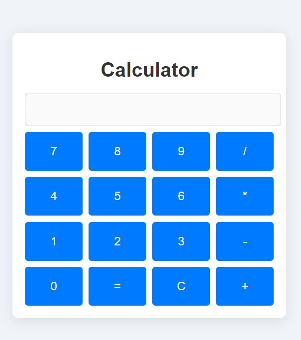

# Calculator Website

## Project Description

This **Calculator Website** is a simple, responsive web-based calculator built using HTML, CSS, and JavaScript. It allows users to perform basic arithmetic operations such as addition, subtraction, multiplication, and division. The design focuses on simplicity and user-friendliness, providing a smooth and intuitive interface for easy calculations. 

## Features

- **Basic Arithmetic Operations**: Supports addition, subtraction, multiplication, and division.
- **Responsive Design**: The calculator adjusts its layout to different screen sizes, ensuring optimal usability on desktops, tablets, and mobile devices.
- **Clear and Backspace Functions**: Users can clear the entire input or remove the last entered digit.
- **Keyboard Input Support**: In addition to clicking on the calculator buttons, users can also use their keyboard for input.

## Technologies Used

- **HTML5**: Used for the website's structure and content layout.
- **CSS3**: Used for styling, including a responsive grid layout and modern design elements.
- **JavaScript**: Used for functionality, enabling real-time calculations as the user interacts with the calculator.

## Installation and Setup

1. Clone the repository or download the project files.
    ```bash
    git clone https://github.com/karim-aboelazm/github_test
    ```

2. Open the `index.html` file in your browser to view and use the calculator.

## Usage Instructions

- **Performing Calculations**: Click on the calculator buttons or use your keyboard to input numbers and operations.
- **Clearing Input**: Click the "C" button to clear all input, or use the "←" button to delete the last entered digit.
- **Keyboard Support**: You can use your keyboard for input:
    - Numbers (0-9)
    - Operators (+, -, *, /)
    - Enter/Return to calculate
    - Backspace to delete the last entry

## Future Improvements

- **Scientific Calculator**: Expand functionality to include scientific calculations (sin, cos, tan, etc.).
- **History Feature**: Add a history log to track past calculations.
- **Themes**: Add support for light/dark themes.



